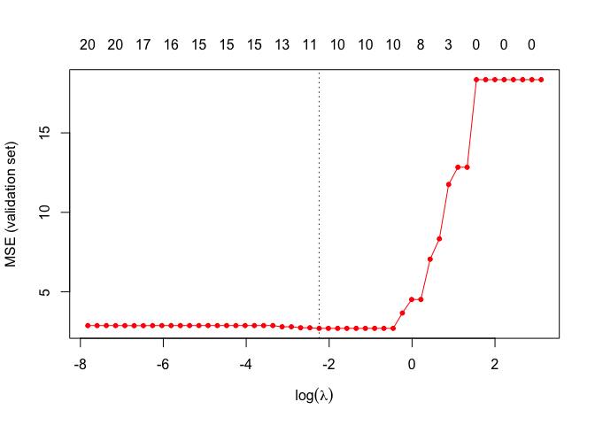

R package
---------

``` r
library(cPCG)
library(fields)
library(mvtnorm)
```

Load functions useful for running COMBSS 
-------------------------------
[Sarat: Is this the correct path for users loading the file directly from github? Or mention that they have to download this file into the working directory.] [Houying: When git clone or download the as the COMBSS-VIGNETTE zip file, the function is in the folder. But it may be better to have a link to download this function directly from this page just in case someone check this page only.] 

``` r
source("Function-for-combss-github.R")
```

From Houying to Benoit
- Error messages with cov.X function, will cov function do the same job? Maybe a package is missing?
- There are a few functions are missing such as noise.compute.from.SNR, ADAM.COMBSS, predict.COMBSS

Generate data from a true model
-------------------------------

``` r
n <- 100
p<- 20
index.true <- seq(1,p,by=2)
K0 <- 10
beta <- rep(0,p)
beta[index.true] <- 1
True.set <- beta !=0
SNR <- 6
rho <- 0.5
matcovX <- cov.X(p,rho)
sigma.2 <- noise.compute.from.SNR(SNR,beta,matcovX)
noise_var <- as.numeric(sigma.2)
set.seed(140)
X <- rmvnorm(n,mean=rep(0,p),sigma=matcovX)
y <- X%*%matrix(beta,ncol=1)+rnorm(n,sd=sqrt(sigma.2))
```

### Generation of a validation set

``` r
Ntest <- 5000
Xtest <- rmvnorm(Ntest,mean=rep(0,p),sigma=matcovX)
ytest <- Xtest%*%matrix(beta,ncol=1)+rnorm(n,sd=sqrt(sigma.2))
```

Parameters for COMBSS
--------------------

``` r
CG <- TRUE
alpha <- 0.1
Niter <- 1000
epoch <- 10
tol <- 0.001
tau=0.5
epoch <- 10
trunc <- 0.001
```

Grid of lambda values
---------------------

``` r
lambda.max <- sum(y*y)/n
c.grid <- 0.8
nlambda <- 50
grid.comb <- rev(lambda.max*(c.grid^(c(0:(nlambda-1)))))
```

Compuation of the MSE on the validation set
-------------------------------------------

``` r
mse <- rep(0,nlambda)
nsel <- rep(0,nlambda)
for(j in 1:nlambda){
#print(j)
lam <- as.numeric(grid.comb[j])
model.combssR <- ADAM.COMBSS(X,y,delta=dim(X)[1],lambda=lam,tau=tau,Niter=Niter,alpha=alpha,epoch=epoch,tol=tol,CG=CG,trunc=trunc)
nsel[j] <- sum(model.combssR$s)
y.pred <- as.vector(predict.COMBSS(model.combssR,Xtest))

if(sum(model.combssR$s)>n){mse[j]<- 9999}else{
  mse[j] <- mean((ytest-y.pred)**2)}
}
```

Choice of lambda based on the MSE from the validation set
---------------------------------------------------------

``` r
lambda.min <- grid.comb[which.min(mse)]
plot(mse~log(grid.comb),type="o",col="red",pch=20,xlab=expression(log(lambda)),ylab="MSE (validation set)")
axis(side=3,at=log(grid.comb),labels=paste(nsel),tick=FALSE,line=0)
abline(v=log(lambda.min),lty=3)
```



Run COMBSS with best lambda
---------------------------

``` r
model.combssF <- ADAM.COMBSS(X,y,delta=dim(X)[1],lambda=lambda.min,tau=tau,Niter=Niter,alpha=alpha,epoch=epoch,tol=tol,CG=CG,trunc=trunc)
```

Confusion matrix
----------------

``` r
Selected <- model.combssF$s
True <- as.logical(beta)
table(True,Selected)
```

    ##        Selected
    ## True    FALSE TRUE
    ##   FALSE    10    0
    ##   TRUE      0   10
