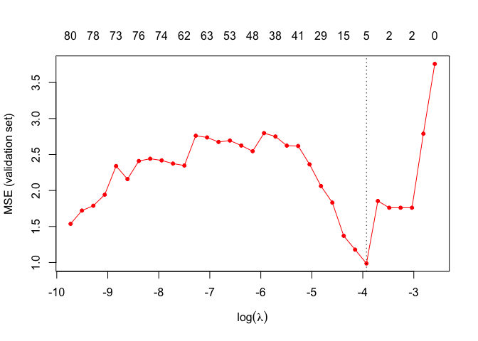

R package
---------

``` r
library(cPCG)
library(fields)
library(mvtnorm)
library(Matrix)
```

load function useful for combss
-------------------------------

``` r
source("Function-for-combss-github.R")
```

Generate data from a true model
-------------------------------

We consider a sample zize of *n* = 100 and *p* = 10, 000 predictors.
Only 3 predictors are actives.

``` r
n <- 100
p<- 10000
index.true <- c(1,1000,5000)
beta <- rep(0,p)
beta[index.true] <- 1
True.set <- beta !=0
```

In the following the code for generated the design matrix and the
outcome. To save some time we have saved the X and y object in
**Data\_Ultra\_High.RData**

``` r
p1 <- 2500
K0 <- 3
SNR <- 5
rho <- 0.5
matcovX <- cov.X(p1,rho)
matcovX.FULL <- bdiag(replicate(4,matcovX,simplify=FALSE))
sigma.2 <- noise.compute.from.SNR(SNR,beta,matcovX.FULL)
noise_var <- as.numeric(sigma.2)
set.seed(140)
Xblock1 <- rmvnorm(n,mean=rep(0,p1),sigma=matcovX)
Xblock2 <- rmvnorm(n,mean=rep(0,p1),sigma=matcovX)
Xblock3 <- rmvnorm(n,mean=rep(0,p1),sigma=matcovX)
Xblock4 <- rmvnorm(n,mean=rep(0,p1),sigma=matcovX)
X <- cbind(Xblock1,Xblock2,Xblock3,Xblock4)
y <- X[,index.true]%*%matrix(beta[index.true],ncol=1)+rnorm(n,sd=sqrt(noise_var))
```

To save some time we have saved this generated data

``` r
load("Data_Ultra_High.RData")
X <- data.ultra.high$X
y <- data.ultra.high$y
```

### Generation of a validation set

``` r
Ntest <- 5000
Xblock1 <- rmvnorm(Ntest,mean=rep(0,p1),sigma=matcovX)
Xblock2 <- rmvnorm(Ntest,mean=rep(0,p1),sigma=matcovX)
Xblock3 <- rmvnorm(Ntest,mean=rep(0,p1),sigma=matcovX)
Xblock4 <- rmvnorm(Ntest,mean=rep(0,p1),sigma=matcovX)
Xtest <- cbind(Xblock1,Xblock2,Xblock3,Xblock4)
ytest <- Xtest[,index.true]%*%matrix(beta[index.true],ncol=1)+rnorm(n,sd=sqrt(noise_var))
```

The generated validation test have also been saved:

``` r
Xtest <- data.ultra.high$Xtest
ytest <- data.ultra.high$ytest
```

Parameter for COMBSS
--------------------

``` r
CG <- TRUE
alpha <- 0.1
Niter <- 1000
epoch <- 10
tol <- 0.001
tau=0.5
epoch <- 10
trunc <- 0.001
```

Grid of lambda values
---------------------

``` r
lambda.max <- sum(y*y)/n
c.grid <- 0.8
nlambda <- 50
grid.comb <- rev(lambda.max*(c.grid^(c(0:(nlambda-1)))))
```

Computation of the MSE on the vlidation set
------------------------------------------

``` r
mse <- NULL
nsel <- NULL
for(j in 1:nlambda){
#print(j)
lam <- as.numeric(grid.comb[j])
model.combssR <- ADAM.COMBSS(X,y,delta=dim(X)[1],lambda=lam,tau=tau,Niter=Niter,alpha=alpha,epoch=epoch,tol=tol,CG=CG,trunc=trunc)
nsel <- c(nsel,sum(model.combssR$s))
y.pred <- as.vector(predict.COMBSS(model.combssR,Xtest))
if(sum(model.combssR$s)>n){mse <- c(mse,9999)}else{
  mse <- c(mse,mean((ytest-y.pred)**2))}
if(sum(model.combssR$s)==0) break
}
```

    

Choice of lambda according MSE on validation set
------------------------------------------------

``` r
lambda.min <- grid.comb[which.min(mse)]
plot(mse~log(grid.comb[1:length(mse)]),type="o",col="red",pch=20,xlab=expression(log(lambda)),ylab="MSE (validation set)")
axis(side=3,at=log(grid.comb[1:length(mse)]),labels=paste(nsel),tick=FALSE,line=0)
abline(v=log(lambda.min),lty=3)
```



Run combss with best lambda
---------------------------

``` r
model.combssF <- ADAM.COMBSS(X,y,delta=dim(X)[1],lambda=lambda.min,tau=tau,Niter=Niter,alpha=alpha,epoch=epoch,tol=tol,CG=CG,trunc=trunc)
```

Confusion matrix
----------------

``` r
Selected <- model.combssF$s
True <- as.logical(beta)
table(True,Selected)
```

    ##        Selected
    ## True    FALSE TRUE
    ##   FALSE  9995    2
    ##   TRUE      0    3
